# GitHub Copilot Administration and Metrics

## 🎯 Learning Objectives

By the end of this exercise, you will understand:
- How GitHub Copilot is administered at the enterprise level
- Metrics and analytics available for measuring GitHub Copilot adoption and impact
- How to measure ROI and developer productivity improvements

## 🍎 Scenario: Scaling GitHub Copilot Across The Daily Harvest

The Daily Harvest has seen tremendous success with GitHub Copilot in your development team! The CTO is now considering rolling out GitHub Copilot across all engineering teams in the organization. As the lead developer who championed the initial adoption, you've been asked to help with the enterprise-wide rollout planning.

Your manager wants to understand:
- How to properly configure GitHub Copilot for enterprise use
- What governance controls are available for security and compliance
- What metrics will help demonstrate value to executive leadership
- How to measure the success and ROI of the GitHub Copilot investment

This lab will explore the administrative and metrics capabilities that make GitHub Copilot suitable for enterprise deployment.

## 🏢 GitHub Copilot Enterprise Administration

### Enterprise Setup and Configuration

GitHub Copilot for Enterprise provides organizations with comprehensive administrative controls and enhanced capabilities:

**Key Enterprise Features:**
- **Organization-wide deployment**: Centralized license management and user provisioning

    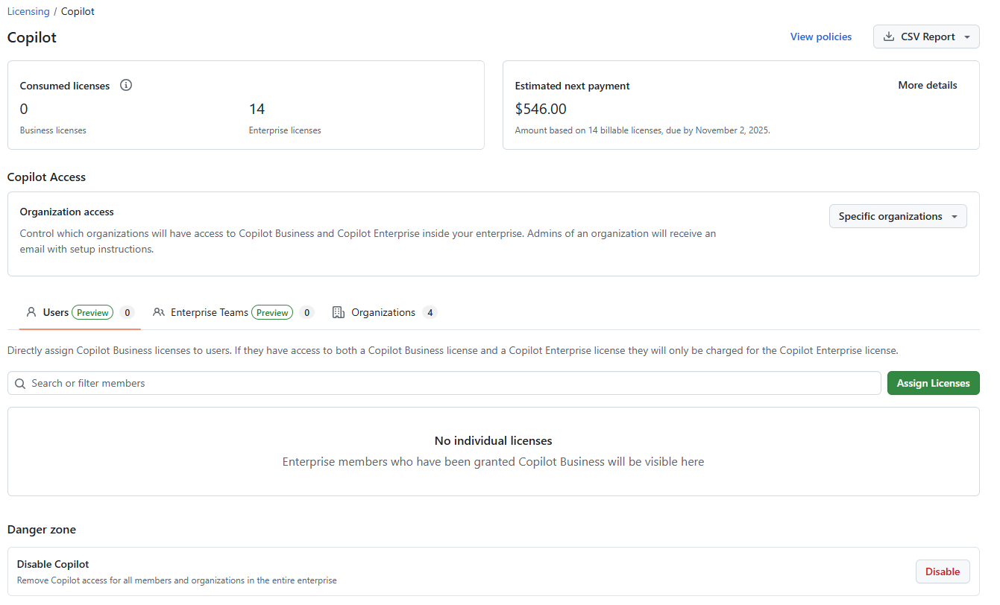

- **Policy controls**: Fine-grained permissions and usage restrictions

    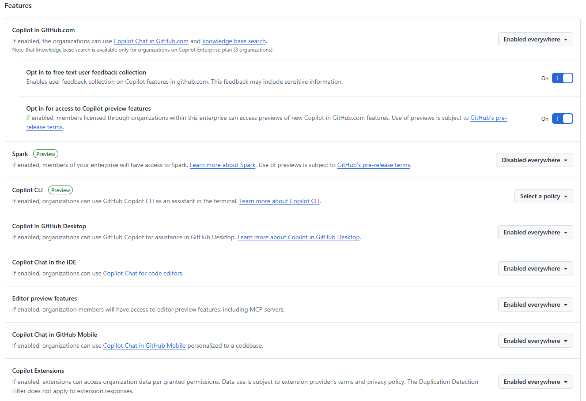

    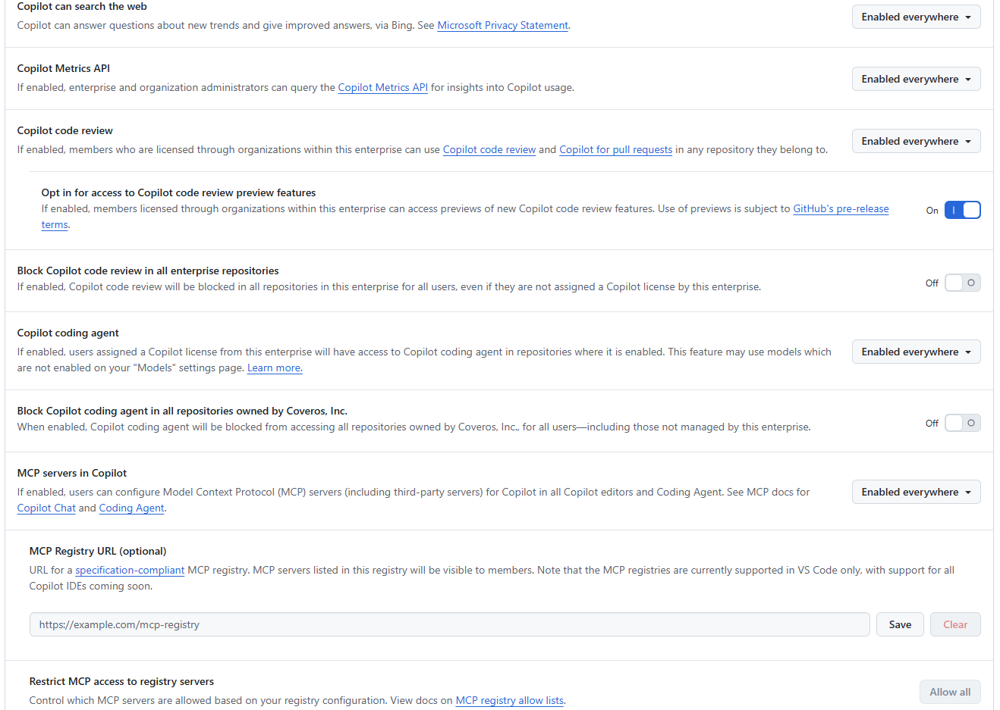

- **Security compliance**: Enterprise-grade data protection and audit capabilities

    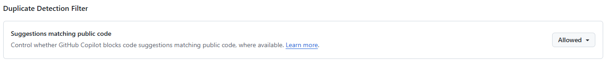

    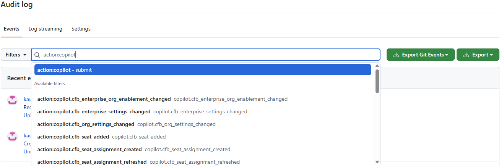

- **Custom models**: Access to organization-specific knowledge and coding patterns

    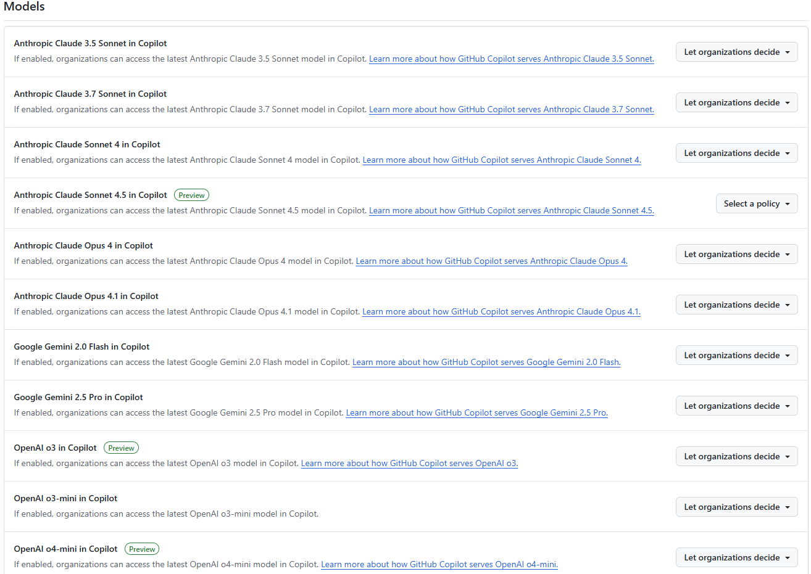

- **Repository access controls**: Limit which repositories GitHub Copilot can access for context

    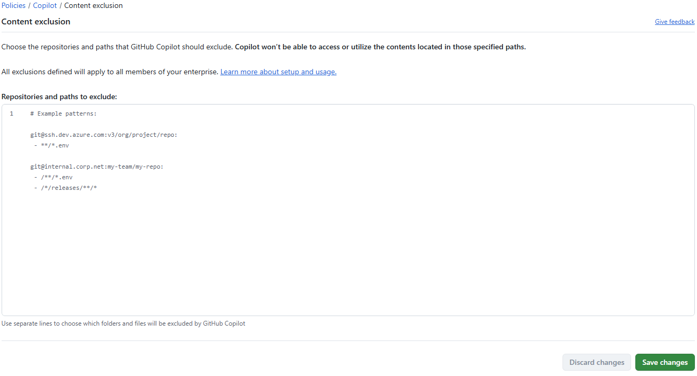

## 📊 GitHub Copilot Metrics and Analytics

### Usage Analytics Dashboard

The GitHub Copilot Analytics Dashboard provides comprehensive insights into adoption and usage patterns across your enterprise:
- **IDE active users**

    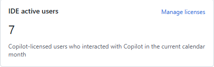

- **Agent adoption**

    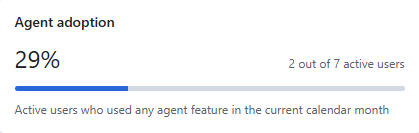

- **Most used chat model**

    

- **IDE daily active users**

    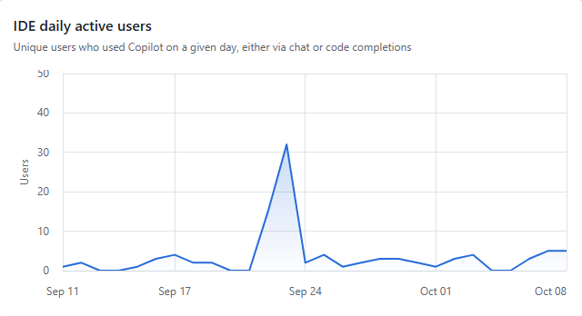

- **IDE weekly active users**

    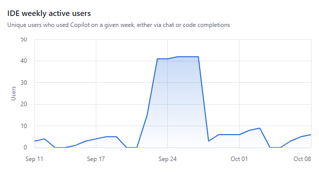

- **Average chat requests per active user**

    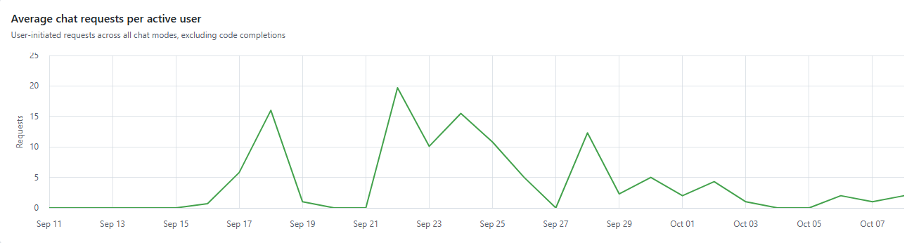

- **Requests per chat mode**

    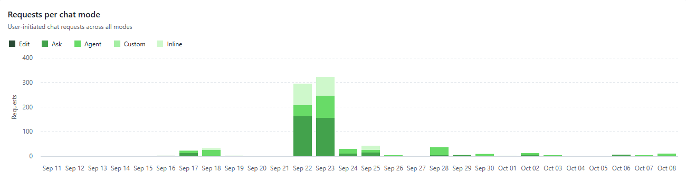

- **Code completions**

    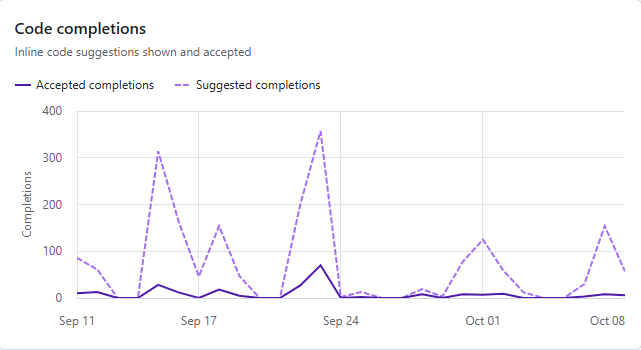

- **Code completions acceptance rate**

    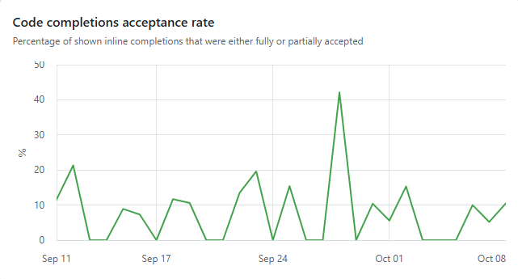

- **Model usage per day**

    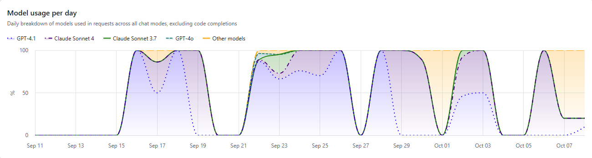

- **Chat model usage**

    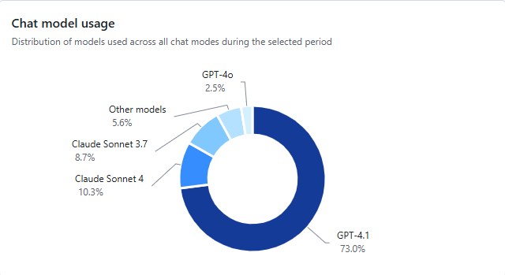

- **Model usage per chat mode**

    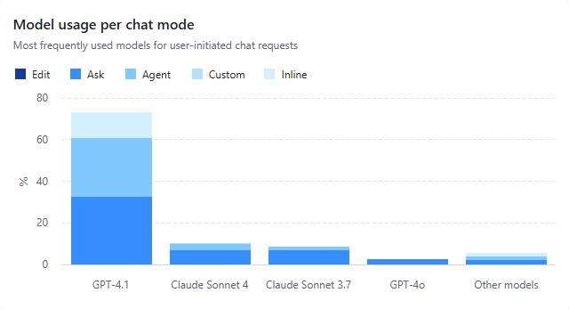

- **Language usage per day**

    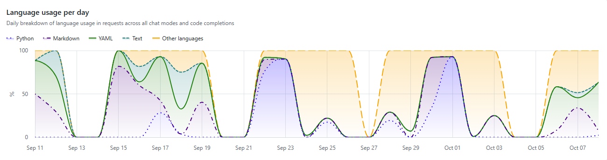

- **Language usage**

    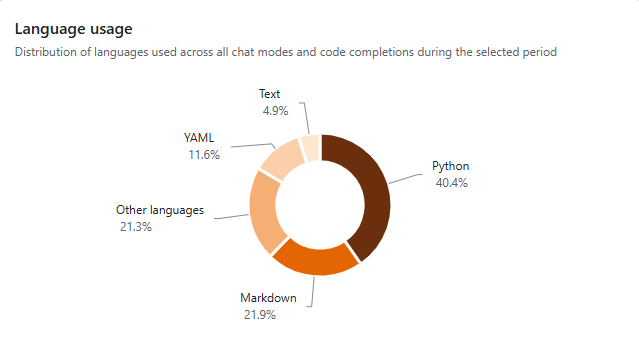

- **Model usage per language**

    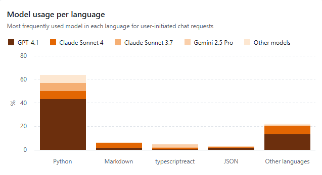

### Business Impact Measurement

**ROI Calculation Framework:**

The Daily Harvest's leadership team can evaluate GitHub Copilot's business impact through several key performance indicators:

**Developer Productivity KPIs:**
- **Feature Delivery Velocity**: Increased speed of new feature development
- **Code Quality Improvements**: Reduced bug reports and faster issue resolution  
- **Developer Satisfaction**: Survey results showing improved developer experience
- **Onboarding Time**: Reduced time for new developers to become productive

**Cost Efficiency Metrics:**
- **Development Cost per Feature**: Reduced engineering costs for feature delivery
- **Technical Debt Reduction**: Decreased time spent on code maintenance and refactoring
- **Training and Ramp-up Costs**: Lower costs for developer skill development
- **Recruitment Advantage**: Improved ability to attract top talent

## 🏆 Exercise Wrap-up

### 🎯 Key Concepts Covered:
- **Enterprise Administration**: Policy management, governance, and security controls
- **Metrics and Analytics**: Comprehensive measurement of adoption, productivity, and business impact  
- **ROI Framework**: Methods for calculating and demonstrating return on investment

### 💡 Strategic Takeaways:

**For Development Leaders:**
- GitHub Copilot provides enterprise-grade administrative controls suitable for large-scale deployment
- Comprehensive metrics enable data-driven decisions about AI adoption and optimization
- Proper governance and security policies ensure GitHub Copilot enhances rather than compromises organizational standards

**For Business Executives:**
- GitHub Copilot's impact can be measured and quantified across multiple business dimensions
- ROI extends beyond just coding speed to include quality, satisfaction, and strategic advantages
- Enterprise features provide the control and visibility needed for confident organizational adoption

**For IT and Security Teams:**
- Robust security and compliance capabilities address enterprise risk management requirements
- Audit trails and policy controls enable governance without limiting developer productivity
- GitHub Copilot metrics can be used in addition to the information provided by existing business intelligence systems

## 🚀 Conclusion

GitHub Copilot's enterprise administration and metrics capabilities make it a powerful tool for organizational transformation. By providing comprehensive visibility into adoption, productivity, and business impact, leaders can make informed decisions about AI integration while maintaining the security and governance standards required for enterprise software development.

The combination of powerful administrative controls, detailed analytics, and proven ROI frameworks positions GitHub Copilot as not just a developer tool, but a strategic enabler of business success in the AI-driven future of software development.
