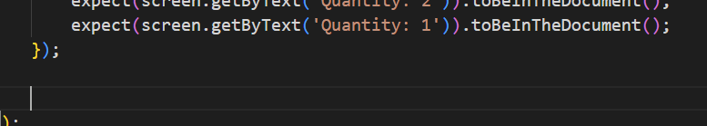

# Exercise 3 - Writing Unit Tests with GitHub Copilot Edit Mode

#### Duration: 30 minutes

## 🎯 Learning Objectives

By the end of this exercise, you will:
- Understand how to use GitHub Copilot's Autocomplete feature and Edit mode for code modifications
- Learn to write comprehensive unit tests with AI assistance
- Improve existing code coverage using intelligent test generation
- Understand best practices for AI-assisted testing

## 🍎 Scenario: Improving The Daily Harvest's Test Coverage

Your manager at The Daily Harvest has noticed that some critical e-commerce functions lack proper test coverage. During yesterday's code review, the team identified several functions in the shopping cart module that need comprehensive unit tests before the next release.

Your task today is to use GitHub Copilot to write high-quality unit tests that will:
- Verify happy path scenarios such as the cart having items
- Test edge cases like the cart being empty
- Improve overall code quality and reliability


## 📊 Step 1: Baseline Testing and Coverage Analysis

Before we start writing new tests, let's establish a baseline by running the existing test suite and checking our current code coverage. We can use what we learned in Exercise 2 about how to run tests in this project.

### Instructions:
1. Navigate to the project directory in your terminal
   ```bash
   cd eCommApp
   ```
2. Run the existing test suite to ensure everything is working:
   ```bash
   npm test
   ```
3. Generate a coverage report to see which parts of the code need additional testing:
   ```bash
   npm run test:coverage
   ```
4. Review the coverage report output in your terminal and note:
   - Overall coverage percentage
   - Which files have low coverage
   - Specific lines or functions that aren't tested

### 💡 What to Look For:
- **Statements**: Percentage of code statements executed during tests
- **Branches**: Percentage of conditional branches tested
- **Functions**: Percentage of functions called during tests
- **Lines**: Percentage of executable lines covered

This baseline will help you understand exactly which test cases you need to add in the following steps.

**Pro Tip:** Keep the coverage report open in a separate terminal tab so you can re-run it after adding new tests to see your progress!


## ✏️ Step 2: Using Autocomplete to Generate One Additional Unit Test

To start off, you'd like to generate one additional unit test. We can use GitHub Copilot's Autocomplete feature to make an addition to the unit test suite.

### Instructions:
1. Open the existing test file named `CartPage.test.tsx` in the `src/components` directory.
2. Place your cursor underneath the existing test and go to a new line.

   

3. Add a comment (starting with '//') stating that you'd like to test the condition where the cart displays an "empty cart message" when it is empty. 
   Please refer to the below sample comment if you get stuck.

   <details>
   <summary>Sample New Test Comment</summary>

     ```
     // Verify that an empty cart message is displayed when the cart is empty.
     ```

   </details>

4. After adding the comment, press `Enter` to go to the next line. GitHub Copilot will start suggesting lines of code, and you can press `Tab` to accept
   one and then press `Enter` to go to the next line, repeating this process until the test is implemented. If GitHub Copilot starts suggesting the next test, you can simply press the `Esc` key to stop the code generation process.

5. Once the test is generated, try running it to make sure that it and the existing test pass. If there are any failures, try asking GitHub Copilot how to fix them.

## 💭 Step 3: Using Edit Mode to Generate Additional Unit Tests

There are many other tests that we can write for `CartPage`. While we could continue using Autocomplete to generate them, that would be very slow and cumbersome. We'll instead use GitHub Copilot's Edit mode to create comprehensive unit tests.

### Why Edit Mode is Perfect for Unit Testing:
- 🎯 **Context-aware**: Understands your existing code structure and testing patterns
- 🔧 **Precise modifications**: Makes targeted changes without affecting unrelated code
- 📋 **Pattern recognition**: Follows your project's testing conventions and style
- 🚀 **Efficiency**: Generates comprehensive test suites quickly

### 🔍 Providing Context for Better Test Generation:
GitHub Copilot automatically gathers context from several sources to understand your codebase:
- **Active editor**: The currently open file and your cursor position
- **Selection**: Any highlighted/selected code in the editor
- **Open tabs**: Files you have open in VS Code tabs
- **Workspace**: Your project structure and related files

However, for generating comprehensive unit tests, you should **explicitly provide context** about the component you're testing. Here's how to improve test generation for `CartPage`:

#### 📋 Best Practices for Test Context:

1. **Open the source file**: Have `CartPage.tsx` open in a tab alongside your test file
2. **Use file references**: Include `@CartPage.tsx` in your prompts to explicitly reference the component
3. **Highlight relevant code**: Select specific methods or sections you want to test
4. **Reference dependencies**: Mention related files like `CartContext.tsx` if your tests need to mock them

**Learn More:** [VS Code Copilot Chat Context Documentation](https://code.visualstudio.com/docs/copilot/chat/copilot-chat-context)

### Instructions:
1. Open GitHub Copilot Chat and switch to Edit mode
2. Include `CartPage.tsx` in your context by opening it in a tab or referencing it in your prompt
3. Write prompts to generate tests for uncovered conditions in `CartPage`. 

<details>
  <summary>Sample Test Generation Prompt</summary>

  ```
  Generate comprehensive unit tests for the CartPage class. Make sure to generate tests that cover negative scenarios and edge cases.
  ```

</details>

<details>
  <summary>More Specific Prompt</summary>

  ```
  Add unit tests that cover the following conditions if they have not already been covered:
   - Checkout button is displayed
   - Checkout modal is rendered properly
   - Checkout modal is closed if the checkout is canceled
  ```

</details>

3. **Important**: Remember that while GitHub Copilot is very powerful it is still a best practice to always review and validate the code generated by AI tools. Make sure to:
   - Check for correctness and completeness
   - Ensure adherence to your project's coding standards
   - Validate that all edge cases are covered

4. Run the newly-generated tests to ensure they pass and verify the expected behavior. If any tests fail you can always ask GitHub Copilot for help fixing them.

### 🎁 Optional Task: Refine tests to handle an edge case that GitHub Copilot didn't cover initially

**Pro Tip:** The more specific and contextual your Edit mode prompts are, the better the generated code will be. Always review and iterate on AI-generated tests to ensure they meet your quality standards!

## 🎓 Step 4: Best Practices and Code Review

Now that you've generated comprehensive unit tests, it's important to ensure they follow industry best practices and maintain high quality. This step focuses on using GitHub Copilot to review and refine your testing approach.

### Why Code Review Matters for AI-Generated Tests:
- 🔍 **Quality Assurance**: Even AI-generated code benefits from systematic review
- 📏 **Standards Compliance**: Ensures tests follow your team's conventions
- 🎯 **Coverage Validation**: Confirms all critical scenarios are tested
- 🛠️ **Maintainability**: Makes tests easier to understand and modify later

Let's use GitHub Copilot to review and improve our test quality.

### Instructions:

Ask GitHub Copilot to review your unit tests and make suggestions for improvement. Consider implementing its suggestions if you have time.

```
@workspace Do these tests follow testing best practices? Check the following and suggest improvements if needed.
- Clear and descriptive test names
- Single responsibility per test
- Clear arrange-act-assert structure
- Single assertion per test (when appropriate)
- Appropriate use of mocks/stubs
- Good error messages
- Good test data setup
- Proper error handling
- Performance considerations
- Maintainable test structure
```

## 🏆 Exercise Wrap-up

Great work! You've successfully used GitHub Copilot's Edit mode to:
- ✅ Generate comprehensive unit tests for critical business logic
- ✅ Cover edge cases and error conditions
- ✅ Improve code coverage and quality
- ✅ Follow testing best practices

### Reflection Questions:
1. **How did Edit mode compare to Autocomplete?**
2. **What types of test scenarios did GitHub Copilot excel at generating?**
3. **Where did you need to provide additional guidance or corrections?**
4. **How might you use Edit mode differently in future testing tasks?**

### Key Takeaways:
- GitHub Copilot's Edit mode is a powerful tool for generating and refining unit tests
- Always review AI-generated code to ensure quality and correctness
- Use specific prompts to guide AI towards your desired outcomes

## 🚀 Next Steps

In Exercise 4, we'll explore GitHub Copilot's **Agent mode** to tackle more complex, multi-file tasks like implementing the complete shopping cart feature with database integration, API endpoints, and frontend components.

#### You have successfully completed the lab. Click on **Next >>** to continue to the next lab.


